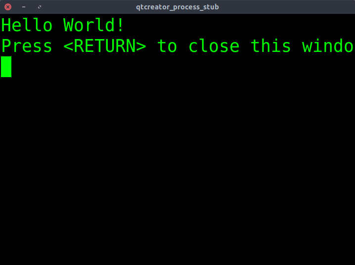

# Exemplo de uso de markdown

Este documento exemplifica o uso de markdown no github para a disciplina dca0800

* alo
* maria
* jose

1. alo
1. maria
1. jose

Os caracteres podem ser *italico*, **negrito**,  _italico_, __negrito__, ~riscado~, `codigo`.

```c
#include <stdio.h>

int main()
{
  // a linha abaixo mostra uma mensagem
  printf("Hello World!\n");
  return 0;
}
```

Markdown também suporta o uso de
[links](http://www.google.com.br)

## Links uteis
* [Markdown cheatsheet](https://github.com/adam-p/markdown-here/wiki/Markdown-Cheatsheet)
* [Mastering Markdown](https://guides.github.com/features/mastering-markdown/)

## Figuras

A figura a seguir mostra um exemplo de uso da interface




## Tabelas

| Tables        | Are           | Cool  |
| ------------- |:-------------:| -----:|
| col 3 is      | right-aligned | $1600 |
| col 2 is      | centered      |   $12 |
| zebra stripes | are neat      |    $1 |
